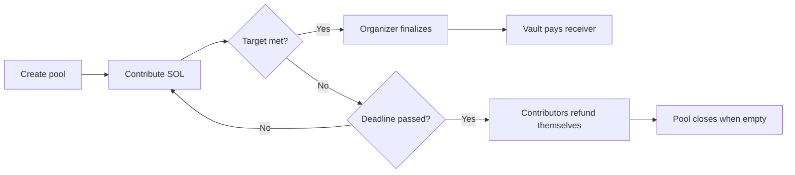

<div align="center">

# GiftPool

**Trustless group-gift escrow on Solana**

GiftPool lets friends collect SOL for a shared gift without trusting one person to hold the money. Funds sit in a program-controlled PDA vault, then either settle to the receiver when the target is reached or become refundable if the pool misses its deadline.

[](https://www.anchor-lang.com/)
[](https://solana.com/)
[](https://www.rust-lang.org/)
[](#tests)

`88S4CSoaugjP3W6mFHq69vmHHa3J7xTaLrE21fzcCxDj`

</div>

---

## Overview

GiftPool replaces the usual "one person collects everything" group-gift flow with a transparent on-chain escrow.

| Role        | What they do                                   | What the program guarantees                        |
| ----------- | ---------------------------------------------- | -------------------------------------------------- |
| Organizer   | Creates a pool with target amount, receiver, and deadline | Can only finalize once the target is met           |
| Contributor | Sends SOL into the pool vault                  | Can claim their own refund if the pool fails       |
| Receiver    | Is fixed when the pool is created              | Receives only tracked contributions from the vault |

The result is simple: no spreadsheet, no awkward chasing, no trusted middleman.

## Product Flow



## On-Chain Model

GiftPool uses the standard Solana escrow shape: deterministic PDAs, a vault with no private key, and program signing through `invoke_signed`.

| Account               | PDA seeds                             | Purpose                                                          |
| --------------------- | ------------------------------------- | ---------------------------------------------------------------- |
| `PoolAccount`         | `["pool", organizer, seed]`           | Pool metadata, receiver, target, deadline, total contributed, status, bump |
| `ContributionAccount` | `["contribution", pool, contributor]` | Per-contributor total amount and refund state                    |
| `Vault`               | `["vault", pool]`                     | System account PDA that holds pooled SOL                         |

### State Machine

```text
Open
  | finalize_pool when total_contributed >= target_amount
  v
Closed

Open
  | first valid refund when deadline passed and target not met
  v
Refunding
  | last refund when total_contributed == 0
  v
Closed
```

## Program Instructions

| Instruction                                        | Who signs   | Main checks                                   | Result                                                     |
| -------------------------------------------------- | ----------- | --------------------------------------------- | ---------------------------------------------------------- |
| `create_pool(seed, name, target_amount, deadline, receiver)` | Organizer   | name length, target > 0, future deadline      | Creates pool PDA, stores receiver, and derives vault PDA   |
| `contribute(amount)`                               | Contributor | pool open, deadline not passed, amount > 0    | Transfers SOL to vault and updates contribution            |
| `finalize_pool()`                                  | Organizer   | organizer signer, stored receiver, pool open, target met | Transfers tracked SOL to receiver and closes pool          |
| `refund_contribution()`                            | Contributor | deadline passed, target not met, not refunded | Sends contributor's amount back, closes contribution account, and closes pool when empty |

## Why This Fits Solana

| Solana primitive   | How GiftPool uses it                                                          |
| ------------------ | ----------------------------------------------------------------------------- |
| PDAs               | Pool, vault, and contribution accounts have deterministic addresses           |
| System Program CPI | Contributions use normal SOL transfers into the vault                         |
| `invoke_signed`    | The program signs vault payouts without any private key                       |
| Anchor constraints | Seed, signer, status, and authorization checks sit next to account validation |
| Checked math       | Contribution totals use checked add/sub operations                            |
| Anchor events      | Create, contribute, finalize, and refund emit indexer-friendly events         |

## Devnet

Program ID:

```text
88S4CSoaugjP3W6mFHq69vmHHa3J7xTaLrE21fzcCxDj
```

Build and deploy:

```bash
anchor build
anchor deploy --provider.cluster devnet
```

`Anchor.toml` maps the same program ID for localnet and devnet. The default provider cluster is localnet so `anchor test` runs against a local validator.

### Demo Transactions

<details>
<summary>Success path</summary>

| Step             | Transaction                                                                                                                                                                                                                          |
| ---------------- | ------------------------------------------------------------------------------------------------------------------------------------------------------------------------------------------------------------------------------------ |
| Create pool      | [`AcVJesDza2wmQgv3nWmchSn6Bswj9WNwgxCk5CrRZsQuqLUH2WGRtQUnprdaN5MGJ7WS9FxEnXzXnhANJEoX5gx`](https://explorer.solana.com/tx/AcVJesDza2wmQgv3nWmchSn6Bswj9WNwgxCk5CrRZsQuqLUH2WGRtQUnprdaN5MGJ7WS9FxEnXzXnhANJEoX5gx?cluster=devnet)   |
| Contribute 1 SOL | [`3eRCKxuP58GgGpkWNor5d292Ty7JsiHHtTQPciSHgY8UeiVJpnXf11pTfR4nVTJYuWWXfhQbFc9nbHeQPsnLkTpw`](https://explorer.solana.com/tx/3eRCKxuP58GgGpkWNor5d292Ty7JsiHHtTQPciSHgY8UeiVJpnXf11pTfR4nVTJYuWWXfhQbFc9nbHeQPsnLkTpw?cluster=devnet) |
| Contribute 1 SOL | [`4tRe1Hd2VBGKnTiw3NmYwXQ8njKfUwK72bbHPK4kw1jPDye5eekNwaZhYmTJ5BnPKRagiDK9puWrPpWdD4MDA7pg`](https://explorer.solana.com/tx/4tRe1Hd2VBGKnTiw3NmYwXQ8njKfUwK72bbHPK4kw1jPDye5eekNwaZhYmTJ5BnPKRagiDK9puWrPpWdD4MDA7pg?cluster=devnet) |
| Finalize         | [`5tYUuFCoFphGbjBDK9oAJBCvezMz1dfn4mnFozXpkjKFTKmnv2d5JLEiKKK9dPbgfg7y2hGeKGxEEm9qR8nr4WLw`](https://explorer.solana.com/tx/5tYUuFCoFphGbjBDK9oAJBCvezMz1dfn4mnFozXpkjKFTKmnv2d5JLEiKKK9dPbgfg7y2hGeKGxEEm9qR8nr4WLw?cluster=devnet) |

</details>

<details>
<summary>Refund path</summary>

| Step             | Transaction                                                                                                                                                                                                                          |
| ---------------- | ------------------------------------------------------------------------------------------------------------------------------------------------------------------------------------------------------------------------------------ |
| Create pool      | [`Y7bsQMPyNmaCJgcdtjYWB4of2qNS8TYyR2FsGXrWcJtm6kfzehhTaCdx74ifrU11WpexzCgbroymTYU3FkQGfCB`](https://explorer.solana.com/tx/Y7bsQMPyNmaCJgcdtjYWB4of2qNS8TYyR2FsGXrWcJtm6kfzehhTaCdx74ifrU11WpexzCgbroymTYU3FkQGfCB?cluster=devnet)   |
| Contribute 2 SOL | [`5FeoAK1u7hemDycDR4kF3J2b2rCAeHzSYpzhnHwSu7saoyn89GEHc7NMN5AGbPF7S6kA8kvH1BMhiAbsSH8yCjPH`](https://explorer.solana.com/tx/5FeoAK1u7hemDycDR4kF3J2b2rCAeHzSYpzhnHwSu7saoyn89GEHc7NMN5AGbPF7S6kA8kvH1BMhiAbsSH8yCjPH?cluster=devnet) |
| Refund           | [`2qYtMZ3M2LxcuBGH4Z6MZFVR6L79DDMdyEsyf8PrbnLF3kJh4tydDqnhXuDDj7JF7QKgZSMs2JKcC54tUEyUx9g6`](https://explorer.solana.com/tx/2qYtMZ3M2LxcuBGH4Z6MZFVR6L79DDMdyEsyf8PrbnLF3kJh4tydDqnhXuDDj7JF7QKgZSMs2JKcC54tUEyUx9g6?cluster=devnet) |

</details>

## Quickstart

```bash
# Install root dependencies
npm install

# Build Anchor program and regenerate IDL/types
anchor build

# Run local validator integration tests
anchor test

# Run the frontend
cd app/web
npm install
npm run dev
```

## Tests

The Anchor suite lives in `tests/giftpool.ts`.

```bash
anchor test
```

Covered:

- create pool
- contribute once
- accumulate contribution from a second wallet
- finalize successful pool
- refund failed pool after deadline
- reject refund before deadline
- reject refund after deadline when target was met
- close failed pool after all tracked refunds are claimed
- reject finalize to an unstored receiver
- reject duplicate pool seeds
- reject invalid targets, past deadlines, zero contributions, late contributions, and unauthorized finalization

## CLI

The devnet CLI lives in `app/cli.ts` and reads `~/.config/solana/id.json`.

```bash
npx ts-node --transpile-only app/cli.ts create <seed> <name> <target_lamports> <deadline_unix> [receiver_pubkey]
npx ts-node --transpile-only app/cli.ts contribute <pool_pubkey> <amount_lamports>
npx ts-node --transpile-only app/cli.ts finalize <pool_pubkey>
npx ts-node --transpile-only app/cli.ts refund <pool_pubkey>
npx ts-node --transpile-only app/cli.ts info <pool_pubkey>
```

## Repository Map

```text
programs/giftpool/src/
  lib.rs                         Anchor account contexts and instruction handlers
  errors.rs                      Program error codes
  state/
    pool_account.rs              PoolAccount and PoolStatus
    contribution_account.rs      ContributionAccount
tests/giftpool.ts                Anchor integration tests
app/cli.ts                       Devnet CLI client
app/web/                         React frontend
Anchor.toml                      Anchor workspace and test script
```

## MVP Boundaries

| Area          | Current behavior                                 | Production hardening                                |
| ------------- | ------------------------------------------------ | --------------------------------------------------- |
| Asset type    | SOL only                                         | Add SPL token support if needed                     |
| Privacy       | Pool names, amounts, and contributors are public | Keep names generic or add off-chain metadata        |
| Receiver      | Receiver is fixed at pool creation               | Add optional receiver change flow with explicit contributor policy if needed |
| Vault balance | Program transfers tracked `total_contributed`    | Add policy for accidental direct SOL transfers      |
| Rent          | Contribution accounts close after refund         | Consider closing pool accounts when lifecycle ends  |
| Indexing      | Anchor events emitted for lifecycle actions      | Add an external indexer for richer analytics        |

## Hardening Backlog

- Decide how the UI should represent pools that are funded but not finalized after deadline.
- Add SPL token support if the demo needs non-SOL gifts.
- Add an accidental-direct-transfer policy for extra lamports sent to vault PDAs.

## License

MIT
